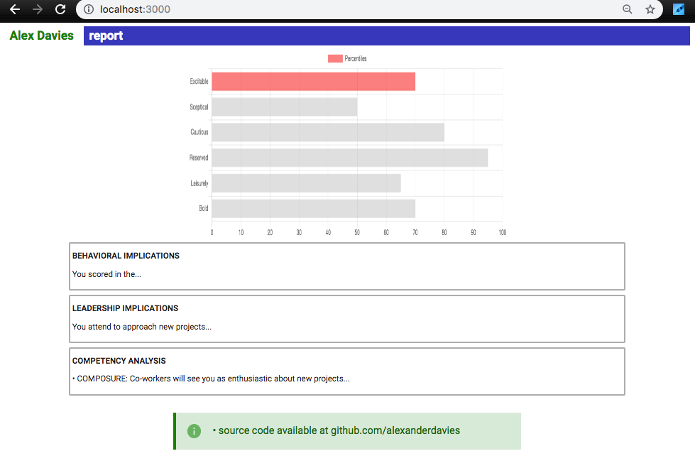
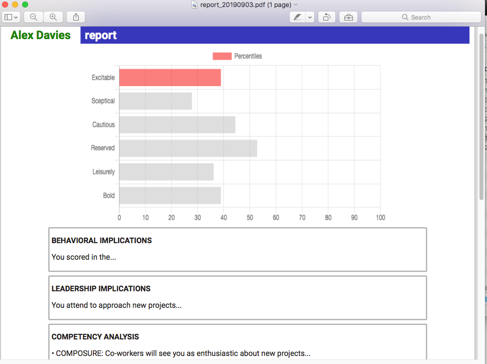

# NodePdfGenerator

This demo demonstrates HTML pdf generation using Node, Puppeteer, ejs render engine and Chart.js

### Installing

Run `npm start` to run the Node.js app server with Nodemon. The server listens on `http://localhost:3000/`. Nodemon will restart the Node server when source files are changed.

avigate to `http://localhost:3000/save-report` to generate a PDF of the web page. The PDF will be located in the reports folder.

## Built With

npm version 6.90

node v10.16.3

see package.json.

# License

This project is licensed under the MIT License - see the [LICENSE.md](LICENSE.md) file for details

