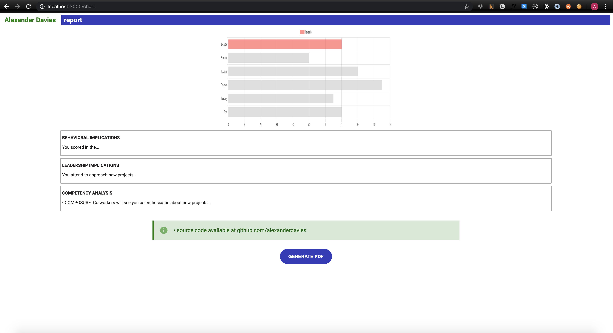

# NodePdfGenerator

This demo demonstrates HTML pdf generation using Node w/ nest.js, Puppeteer, ejs render engine and Chart.js

### Installing

Run `npm start`
The server listens on `http://localhost:3000/`.

Navigate to `http://localhost:3000/chart` and click the button to generatte the report.

## Built With

npm version 6.14.3

node v14.2.0

see package.json.

# License

This project is licensed under the MIT License - see the [LICENSE.md](LICENSE.md) file for details

